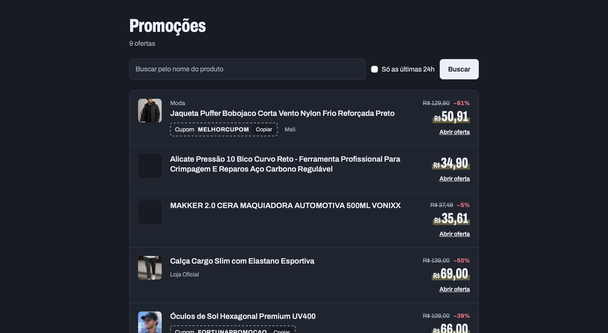
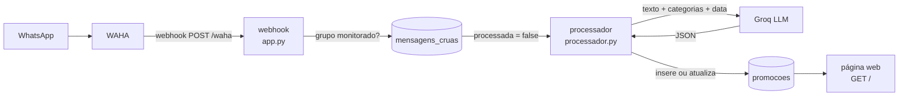
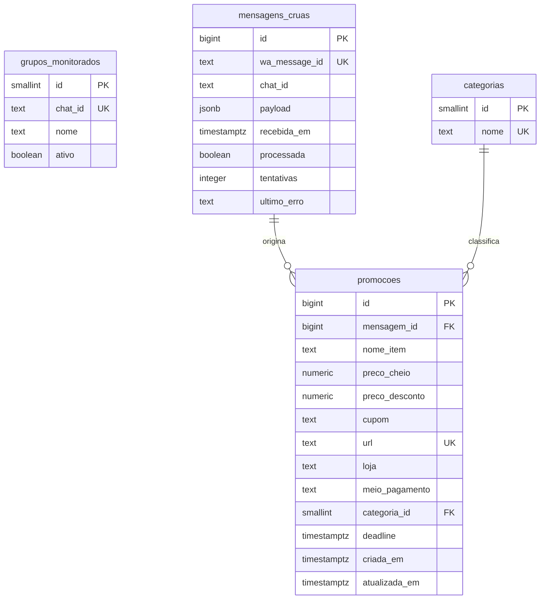

# promo-pipeline

Pipeline de dados (ETL) que monitora grupos de promoções do WhatsApp, usa IA generativa para transformar mensagens em texto livre em dados estruturados e exibe tudo numa página com busca em tempo real.




---

## Sumário

- [Sobre o projeto](#sobre-o-projeto)
- [Funcionalidades](#funcionalidades)
- [Arquitetura](#arquitetura)
- [Tecnologias](#tecnologias)
- [Decisões técnicas](#decisões-técnicas)
- [Modelo de dados](#modelo-de-dados)
- [Estrutura do projeto](#estrutura-do-projeto)
- [Como rodar](#como-rodar)
- [Operação](#operação)
- [Segurança](#segurança)
- [Desafios e aprendizados](#desafios-e-aprendizados)
- [Limitações e próximos passos](#limitações-e-próximos-passos)
- [Autor](#autor)

---

## Sobre o projeto

Grupos de promoções postam dezenas de ofertas por dia, cada uma escrita de um jeito:

```
QUEM NÃO COMPROU É MALUCO
menor preço no coringa da nike

Tênis Nike Sb Chron 2 Canvas (37 ao 44)

De R$ 449 por R$ 199

Loja Oficial Nike
https://tidd.ly/3FUX0Cw
```

Muitos desses grupos usam mensagens temporárias, então as ofertas somem em poucos dias. E não dá para pesquisar, filtrar ou comparar nada.

Este projeto captura cada mensagem assim que ela chega, pede para um LLM extrair os dados e grava o resultado como uma linha consultável:

| nome_item | preco_cheio | preco_desconto | cupom | loja | categoria | url |
|---|---|---|---|---|---|---|
| Tênis Nike Sb Chron 2 Canvas | 449.00 | 199.00 | — | Loja Oficial Nike | Moda | https://tidd.ly/3FUX0Cw |

O sistema inteiro sobe com um único `docker compose up`.

> Projeto de estudo, construído para entender cada etapa de um pipeline de dados real: webhooks, filas, bancos relacionais, integração com LLMs e conteinerização.

---

## Funcionalidades

### Ingestão
- **Recebimento em tempo real** das mensagens pelo webhook do [WAHA](https://waha.devlike.pro/)
- **Filtro de grupos configurável pelo banco:** a tabela `grupos_monitorados` define quais grupos são salvos, e a coluna `ativo` liga ou desliga um grupo sem alterar código
- **Armazenamento do dado cru** em `jsonb`, exatamente como chegou
- **Idempotência:** mensagens reenviadas pelo WAHA não são duplicadas

### Processamento com IA
- **Extração estruturada** de produto, preço cheio, preço promocional, cupom, link, loja, meio de pagamento, categoria e prazo da oferta
- **Classificação:** mensagens que não são promoção (avisos, conversas) são identificadas e descartadas
- **Categorização automática** a partir das categorias cadastradas no banco
- **Interpretação de prazos relativos:** "só hoje" e "acaba amanhã" viram uma data real, calculada a partir da data de envio da mensagem
- **Atualização de repostagens:** quando a mesma oferta é postada de novo, a promoção existente é atualizada em vez de duplicada
- **Tolerância a falhas:** um erro numa mensagem não interrompe o processamento das outras
- **Mensagens problemáticas** (*poison messages*) são abandonadas depois de 5 tentativas, com o último erro registrado no banco
- **Respeito ao limite de requisições** do plano gratuito da API

### Interface web
- **Lista de promoções** com nome, preço, desconto em %, cupom, loja, categoria, prazo e miniatura
- **Busca em tempo real** pelo nome do produto, sem recarregar a página
- **Filtro das últimas 24 horas**
- **Filtros no endereço da página:** uma busca pode ser salva ou compartilhada
- **Botão para copiar o cupom**
- **Preços no formato brasileiro** (`R$ 2.199,00`)
- **Tema escuro automático** e **layout responsivo** para celular

---

## Arquitetura



O sistema é dividido em **duas fases independentes**, ligadas pela coluna `processada`:

1. **Ingestão (`app.py`):** o WAHA avisa o webhook a cada mensagem nova. O webhook confere se o grupo está cadastrado, grava a mensagem crua e responde imediatamente. Ele não interpreta nada.
2. **Processamento (`processador.py`):** um worker busca as mensagens pendentes de tempos em tempos, envia o texto ao LLM, grava o resultado em `promocoes` e marca a mensagem como processada.

A página web é servida pelo mesmo serviço Flask do webhook e lê direto do banco.

Os quatro serviços rodam no Docker Compose:

| Serviço | Imagem | Função |
|---|---|---|
| `waha` | `devlikeapro/waha` | Conexão com o WhatsApp |
| `postgres` | `postgres:16-alpine` | Banco de dados |
| `webhook` | construída pelo `Dockerfile` | Recebe as mensagens e serve a página |
| `processador` | construída pelo `Dockerfile` | Extrai os dados com o LLM |

---

## Tecnologias

| Tecnologia | Uso no projeto |
|---|---|
| **Python 3.12** | Webhook, worker e página |
| **Flask** | Servidor HTTP: rota do webhook e rota da página |
| **Jinja** | Templates HTML renderizados no servidor |
| **psycopg 3** | Driver do PostgreSQL, com consultas parametrizadas e `dict_row` |
| **PostgreSQL 16** | Banco relacional, com `jsonb`, chaves estrangeiras e índices |
| **Groq** (`openai/gpt-oss-120b`) | LLM que extrai os dados das mensagens |
| **SDK da OpenAI** | Cliente da API, apontado para o Groq via `base_url` |
| **WAHA** | API HTTP para o WhatsApp, com envio de webhooks |
| **Docker e Docker Compose** | Conteinerização e orquestração dos 4 serviços |
| **python-dotenv** | Leitura de variáveis de ambiente do `.env` |
| **HTML, CSS e JavaScript** | Interface, sem frameworks |

---

## Decisões técnicas

### Separar ingestão e processamento
Uma chamada ao LLM leva segundos. Se o webhook esperasse a IA, o WAHA poderia interpretar a demora como falha e reenviar a mensagem. Com as duas fases separadas:
- o webhook responde em milissegundos;
- se a API da IA sair do ar, as mensagens continuam sendo guardadas e esperam na fila;
- um erro no processamento não afeta a ingestão.

### Guardar a mensagem crua
O payload completo é salvo em `jsonb` antes de qualquer interpretação. Com isso, dá para melhorar as instruções da IA e **reprocessar o histórico inteiro**. Isso foi usado na prática: quando a extração de categoria e prazo foi adicionada, as promoções antigas foram preenchidas reprocessando as mensagens já salvas.

### Idempotência em duas camadas
- **Mensagens:** `wa_message_id` é `UNIQUE`, e o `INSERT` usa `ON CONFLICT (wa_message_id) DO NOTHING`. Um reenvio do WAHA é ignorado, e o webhook responde 200 para ele parar de tentar.
- **Promoções:** `url` é `UNIQUE`, e o `INSERT` usa `ON CONFLICT (url) DO UPDATE ... EXCLUDED`. Uma repostagem atualiza preço, cupom e prazo, muda o `atualizada_em` e preserva o `criada_em`.

### Prompt engineering para saída estruturada
- As instruções definem um **esquema JSON explícito**, com o nome e o tipo de cada campo, iguais aos das colunas do banco.
- `response_format={"type": "json_object"}` garante que a resposta seja um JSON válido.
- `temperature=0` deixa a extração determinística: a mesma mensagem gera a mesma resposta.
- Regras explícitas: preços como número, `null` quando a informação não estiver na mensagem, e **"nunca invente informações"**.
- `reasoning_effort="low"`: a tarefa é simples, e pensar menos gasta menos tokens.

### Contexto dinâmico no prompt
- **Categorias:** a lista é lida do banco a cada rodada e enviada à IA com os IDs. Uma categoria nova passa a valer sem reiniciar o worker.
- **Validação da resposta:** se a IA devolver um `categoria_id` que não existe, ele é trocado por `NULL` antes do `INSERT`. Assim a chave estrangeira não recusa a promoção inteira.
- **Data de envio:** vai junto com a mensagem, já convertida para o horário de Brasília (`AT TIME ZONE 'America/Sao_Paulo'`), para a IA resolver prazos como "acaba amanhã".

### Só o texto vai para a IA
O payload tem centenas de campos técnicos e uma miniatura em base64. Enviar só o `body` reduz o custo em tokens, melhora a qualidade da extração e evita mandar identificadores de pessoas para um serviço externo.

### Fila no próprio banco, com tentativas
- O worker processa as mensagens em ordem (`ORDER BY id`), e cada uma tem seu próprio `try/except`: uma falha não trava as seguintes.
- A mensagem que falha continua pendente e é tentada na próxima rodada. As colunas `tentativas` e `ultimo_erro` registram o histórico.
- Depois de 5 falhas, ela deixa de ser tentada. Isso evita consumir a cota da API para sempre com uma mensagem que nunca vai funcionar.
- A ordem das operações garante que nada se perde: a promoção é gravada **antes** de a mensagem ser marcada como processada.

### Rate limit do plano gratuito
O plano gratuito do Groq aceita 30 requisições por minuto. O worker espera 2 s entre chamadas (60 s ÷ 30) e 120 s entre rodadas. Mesmo com muitas mensagens acumuladas, o limite nunca é ultrapassado.

### SDK compatível com OpenAI
A API do Groq é compatível com a da OpenAI. Usando o SDK oficial da OpenAI com `base_url`, trocar de provedor exige mudar pouca coisa no código.

### Busca com SQL montado com segurança
O `WHERE` é montado com `if`s, acrescentando só os filtros pedidos. A consulta junta apenas **trechos fixos** escritos no código. O texto digitado pelo usuário entra sempre por **parâmetro nomeado** (`%(padrao)s`) e nunca é concatenado ao SQL.

### Busca em tempo real com *progressive enhancement*
- A busca continua sendo feita no servidor. O JavaScript só muda quem faz a requisição.
- **Debounce de 300 ms:** a consulta só é feita quando o usuário para de digitar, e não a cada tecla.
- `fetch` e `DOMParser` trocam apenas a lista, sem recarregar a página nem tirar o foco do campo.
- `history.replaceState` mantém o endereço sincronizado com a busca.
- Sem JavaScript, o formulário continua funcionando normalmente.
- O botão de copiar cupom usa **delegação de eventos**, para continuar funcionando depois que a lista é substituída.

### Uma imagem para dois serviços
O webhook e o processador precisam do mesmo Python e das mesmas bibliotecas. Um único `Dockerfile` atende os dois, e o compose define o `command` de cada um.

### Ordem de inicialização garantida
O Postgres tem um `healthcheck` com `pg_isready`, e os serviços Python usam `depends_on: condition: service_healthy`. Eles só iniciam quando o banco já aceita conexões. Com `restart: unless-stopped`, um serviço que cai (por exemplo, por perder a conexão com o banco) é reiniciado sozinho.

### Dockerfile otimizado
- O `requirements.txt` é copiado e instalado **antes** do código. Mudanças no código reaproveitam a camada de dependências em cache e não reinstalam nada.
- `.dockerignore` mantém fora da imagem o `.env`, a sessão do WhatsApp, o `.venv` e os dados do banco.
- `PYTHONUNBUFFERED=1` faz os `print`s aparecerem na hora nos logs do Docker.

### Tipos de dados adequados
- `numeric(10,2)` para dinheiro, sem erros de arredondamento de ponto flutuante.
- `timestamptz` para datas: o momento é guardado de forma absoluta, e o fuso é aplicado só na exibição.
- `jsonb` para o payload, que permite consultar dentro do JSON (`payload->>'body'`).

---

## Modelo de dados



| Tabela | Conteúdo |
|---|---|
| `grupos_monitorados` | Grupos cujas mensagens são salvas |
| `mensagens_cruas` | Cópia fiel de cada mensagem recebida, com o estado do processamento |
| `categorias` | Categorias de produtos usadas pela IA |
| `promocoes` | Dados extraídos pela IA |

- `promocoes.mensagem_id` usa `ON DELETE SET NULL`: apagar uma mensagem não apaga a promoção.
- Índice composto em `mensagens_cruas (chat_id, recebida_em DESC)`.

### Migrações

A estrutura do banco é versionada em arquivos SQL numerados, aplicados em ordem:

| Arquivo | O que faz |
|---|---|
| `001_inicial.sql` | Estrutura inicial das tabelas, gerada com `pg_dump --schema-only` |
| `002_tentativas.sql` | Colunas `tentativas` e `ultimo_erro` para o controle de falhas |
| `003_categorias_iniciais.sql` | Categorias iniciais (*seed*), com `ON CONFLICT DO NOTHING` para poder rodar mais de uma vez |

---

## Estrutura do projeto

```
promo-pipeline/
├── app.py                  # webhook (POST /waha) e página (GET /)
├── processador.py          # worker que extrai os dados com o LLM
├── templates/
│   └── promocoes.html      # página: HTML, CSS e JavaScript
├── migrations/
│   ├── 001_inicial.sql
│   ├── 002_tentativas.sql
│   └── 003_categorias_iniciais.sql
├── docs/
│   └── screenshot.png
├── Dockerfile              # imagem usada pelo webhook e pelo processador
├── docker-compose.yml      # os 4 serviços
├── requirements.txt
├── .env.example            # modelo das variáveis de ambiente
├── .dockerignore
└── .gitignore
```

As pastas `sessions/` (sessão do WhatsApp) e `postgres-data/` (dados do banco) são criadas ao rodar e ficam fora do repositório.

---

## Como rodar

### Pré-requisitos
- Docker e Docker Compose
- Uma chave de API do [Groq](https://console.groq.com/keys) (o plano gratuito é suficiente)
- Um número de WhatsApp para conectar ao WAHA

### 1. Configurar as variáveis de ambiente

```bash
cp .env.example .env
```

Preencha no `.env`, no mínimo:

```
POSTGRES_PASSWORD=   # só letras e números (entra na URL de conexão)
GROQ_API_KEY=
```

E as credenciais do painel do WAHA (`WAHA_API_KEY`, `WAHA_DASHBOARD_PASSWORD` etc.).

### 2. Subir os serviços

```bash
docker compose up -d --build
```

### 3. Criar as tabelas

Aplique as migrações em ordem:

```bash
docker compose exec -T postgres psql -U waha -d waha_app < migrations/001_inicial.sql
docker compose exec -T postgres psql -U waha -d waha_app < migrations/002_tentativas.sql
docker compose exec -T postgres psql -U waha -d waha_app < migrations/003_categorias_iniciais.sql
```

### 4. Conectar o WhatsApp

Acesse o painel do WAHA em `http://localhost:3000/dashboard`, inicie uma sessão e leia o QR code com o WhatsApp.

### 5. Cadastrar os grupos monitorados

Descubra o ID do grupo (termina em `@g.us`) pela rota `GET /api/{session}/groups` do WAHA, disponível no Swagger em `http://localhost:3000`. Depois:

```bash
docker compose exec postgres psql -U waha -d waha_app
```

```sql
INSERT INTO grupos_monitorados (chat_id, nome) VALUES ('ID_DO_GRUPO@g.us', 'Nome do grupo');
```

### 6. Usar

Acesse `http://localhost:8080`. As promoções aparecem conforme chegam aos grupos cadastrados e são processadas, em até 2 minutos.

---

## Operação

### Logs

```bash
docker compose logs -f webhook processador
```

### Consultas úteis

Últimas mensagens recebidas:

```sql
SELECT id, payload->>'body' AS texto, recebida_em, processada
FROM mensagens_cruas
ORDER BY id DESC
LIMIT 10;
```

Promoções com a categoria:

```sql
SELECT p.nome_item, p.preco_desconto, c.nome AS categoria, p.deadline
FROM promocoes p
LEFT JOIN categorias c ON c.id = p.categoria_id
ORDER BY p.atualizada_em DESC;
```

Mensagens abandonadas depois de 5 tentativas, e o motivo:

```sql
SELECT id, tentativas, ultimo_erro, payload->>'body' AS texto
FROM mensagens_cruas
WHERE NOT processada AND tentativas >= 5;
```

Devolver as mensagens abandonadas para a fila (por exemplo, depois de uma instabilidade da API):

```sql
UPDATE mensagens_cruas SET tentativas = 0, ultimo_erro = NULL
WHERE NOT processada AND tentativas >= 5;
```

Reprocessar todo o histórico (por exemplo, depois de melhorar as instruções da IA):

```sql
UPDATE mensagens_cruas SET processada = false, tentativas = 0;
```

### Desligar um grupo sem apagá-lo

```sql
UPDATE grupos_monitorados SET ativo = false WHERE nome = 'Nome do grupo';
```

---

## Segurança

- **Segredos fora do código:** senhas e chaves ficam no `.env`, que não vai para o Git. O `.env.example` documenta as variáveis sem os valores reais.
- **Senha em um lugar só:** a `DATABASE_URL` dos serviços Python é montada no `docker-compose.yml` a partir de `POSTGRES_PASSWORD`.
- **Sessão do WhatsApp protegida:** a pasta `sessions/` dá acesso à conta e está no `.gitignore` e no `.dockerignore`.
- **Portas só locais:** todas as portas são publicadas em `127.0.0.1`, acessíveis apenas pela própria máquina.
- **SQL injection:** todas as consultas usam parâmetros (`%s` e `%(nome)s`), nunca concatenação de valores.
- **XSS:** o conteúdo das mensagens, escrito por terceiros, é escapado pelo autoescape do Jinja.
- **Modo debug desligado** no Flask.

---

## Desafios e aprendizados

Alguns problemas reais encontrados durante o desenvolvimento:

- **Bugs silenciosos.** Um `UPDATE` fora do `for`, por causa da indentação, marcaria como processada só a última mensagem de cada rodada, sem gerar nenhum erro. Um cursor sem `.fetchall()` sempre conta como "verdadeiro", o que desativaria o filtro de grupos. Esses casos mostraram a importância de testar o caminho que deveria ser bloqueado, e não só o que deveria funcionar.
- **Onde colocar o `try`.** Com o `try` em volta do laço inteiro, uma única mensagem com erro travava a fila toda. Movê-lo para dentro do laço isolou as falhas por mensagem.
- **Fusos horários.** As datas apareciam três horas adiantadas. O dado estava certo (em UTC), e a diferença estava só na exibição. Isso levou a enviar a data já convertida para a IA, para ela não errar o dia de "acaba hoje".
- **Rede no Docker.** Dentro de um container, `localhost` é o próprio container. Os serviços passaram a se encontrar pelo nome (`postgres`, `webhook`) na rede interna do Compose.

---

## Limitações e próximos passos

- [ ] **Testes automatizados** para a extração e para as rotas
- [ ] **Pool de conexões:** hoje cada serviço usa uma conexão criada na inicialização, e a recuperação de quedas depende do `restart` do Docker
- [ ] **Servidor de produção** (gunicorn) no lugar do servidor de desenvolvimento do Flask
- [ ] **Busca sem acento** com a extensão `unaccent` do PostgreSQL (hoje `tenis` não encontra "Tênis")
- [ ] **Imagens em alta resolução:** a miniatura atual vem da prévia do link (32×32 px) e não existe quando a oferta é enviada como foto
- [ ] **Histórico de preços:** hoje uma repostagem sobrescreve o preço anterior
- [ ] **Identificação de repostagens:** a mesma oferta com outro link encurtado é tratada como uma promoção nova
- [ ] **Migrações automáticas** na primeira inicialização do banco

**Observação:** o WAHA usa o WhatsApp Web, e não a API oficial do WhatsApp. Para estudo, funciona bem. Em produção, existe o risco de bloqueio do número.

---

## Autor

**William Graham Rocha**

[LinkedIn](https://www.linkedin.com/in/wgrahamr) · [GitHub](https://github.com/wgrahamr)
